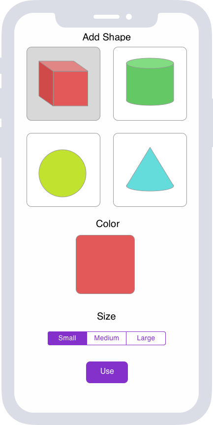
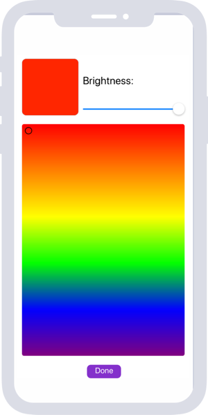

# Software Requirements Specification

## Content
1. [Introduction](#1)  
  1.1. [Purpose](#1.1)  
  1.2. [Document conventions](#1.2)  
  1.3. [Project scope](#1.3)  
  1.4. [User Requirements](#1.4)  
2. [User Requirements](#2)  
  2.1. [Software Interfaces](#2.1)  
  2.2. [User Interfaces](#2.2)  
  2.3. [User Characteristics](#2.3)  
  2.4. [Assumptions and Dependencies](#2.4)  
3. [System Requirements](#3)  
  3.1 [Functional Requirements](#3.1)  
  3.2 [Non-Functional Requierements](#3.2)  

<a name="1"/>

## 1. Introduction

<a name="1.1"/>

### 1.1 Purpose
The purpose of AR Drawing tool for iOS is lets users make simple 3D drawings in augmented reality. 

<a name="1.2"/>

### 1.2 Document conventions
| Term | Definition |
|:---|:---|
| AR | Augmented reality (AR) is a type of interactive, reality-based display environment that takes the capabilities of computer generated display, sound, text and effects to enhance the user's real-world experience. | 
| Scene | The SceneKit scene to be displayed in view. |
| IUndo | Function performed to reverse the action of an earlier action. |
| Reset | Function performed to reverse all user actions. |
| AR object | 3D object that can be displayed in the AR. |
| Shape | AR object that has three dimensions. |
| Device | Mobile phone with certain characteristics. |

<a name="1.3"/>

### 1.3 Project scope
The "AR Drawing tool for iOS" allows users to create simple 3D drawings in AR. The user can select objects from the list of basic shapes, select their color and size, and then place them in front of the camera or on the surface.

<a name="1.4"/>

### 1.4 References
* [Human Interface Guidelines](https://developer.apple.com/design/human-interface-guidelines/ios/overview/themes/)
* [Apple Developer Documentation](https://developer.apple.com/documentation)

<a name="2"/>

## 2. User Requirements

<a name="2.1"/>

### 2.1 Software Interfaces
Swift language and integrated development environment Xcode will be used to develop the application.

| Framework | Discription |
|:---|:---|
| Foundation | The Foundation framework provides a base layer of functionality for apps and frameworks, including data storage and persistence, text processing, date and time calculations, sorting and filtering, and networking. |
| UIKit | Used to construct and manage a graphical, event-driven user interface. |
| ARKit | Integrate iOS device camera and motion features to produce augmented reality experiences in app or game. |
| SceneKit | Create 3D games and add 3D content to apps using high-level scene descriptions. Easily add animations, physics simulation, particle effects, and realistic physically based rendering. SceneKit combines a high-performance rendering engine with a descriptive API for import, manipulation, and rendering of 3D assets. |

<a name="2.2"/>

### 2.2 User Interfaces
AR scene screen provides acces to the main functionality of the application. Allows to add 3D objects and select add mode.

Screen for choosing a shape. Allows to select shape of the object it's color and size.

Color picker screen allow to select Color.

<a name="2.3"/>

### 2.3 User Characteristics
Children and youth who are interested in technology. And people of other age categories who are interested AR.

<a name="2.4"/>

### 2.4 Assumptions and Dependencies
1. User permission to access the camera must be obtained.
2. The compass and accelerometer of the device should work correctly.
3. The application can be used only in good lighting.
4. When user interact with app he should move device at slow, steady pace.

<a name="3"/>

## 3. System Requirements

<a name="3.1"/>

### 3.1 Functional Requirements
The user is provided with the following options:

| Function | Requirments |
|:---|:---|
| Camera image | The application should display the camera image in real time. |
| Display AR | Display AR objects and keep their position on scene constant. |
| Add AR object | The application should provide the ability to add new AR objects to the scene. |
| Place AR object | It should be possible to place the AR object against the camera. At a distance of 20 centimeters. Or on the detected surface. |
| Undo | Delete last added AR object. |
| Reset | Delete all added AR objects. |
| Shape picker | It should be possible to choose shape from basic shapes. |
| Size | Size picker should provide the ability to choose size of shape from 3 sezes: small, medium or large. |
| Color picker | Color picker should provide the ability to choose color of shape using the color palette and brightness level |

<a name="3.2"/>

### 3.2 Non-Functional Requirements
1. No less than 30 fps
2. constant position of objects on scene
